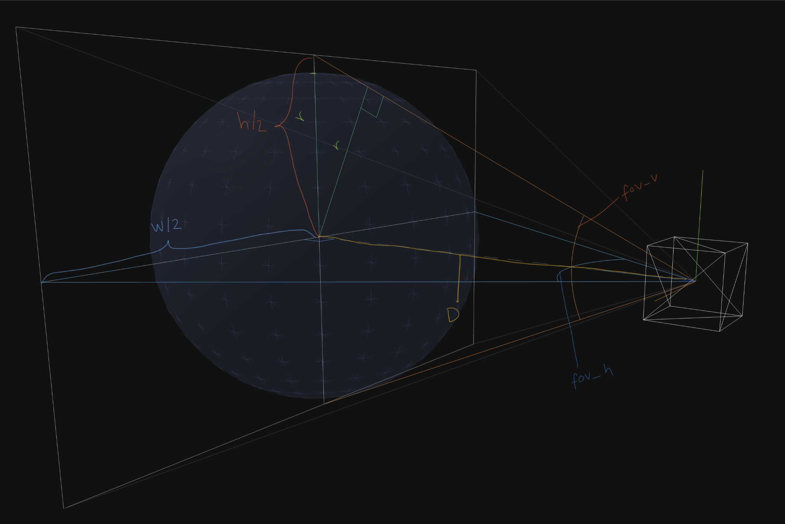
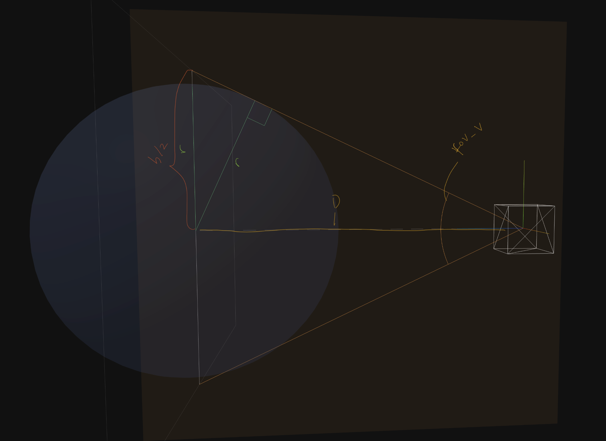

How to set the distance of the camera to fit the bounding sphere?
Implemented here: https://github.com/yomotsu/camera-controls/blob/dev/src/CameraControls.ts#L2447
- We need the minimum between the vertical and horizontal fovs and adjust the distance of the camera to match that to fit the sphere using trigonometry
### Vetical FOV
 Threejs constructs the camera with the vertical fov and returns that value
### Horizontal FOV

- Has to be found manually: https://stackoverflow.com/questions/26655930/90-degree-field-of-view-without-distortion-in-three-perspectivecamera

$$
\tan\!\left(\frac{\mathrm{FOV}_v}{2}\right) = \frac{h/2}{D}
\quad\Longrightarrow\quad
h = 2D\,\tan\!\left(\frac{\mathrm{FOV}_v}{2}\right)
$$

$$
\tan\!\left(\frac{\mathrm{FOV}_h}{2}\right) = \frac{w/2}{D}
\quad\Longrightarrow\quad
w = 2D\,\tan\!\left(\frac{\mathrm{FOV}_h}{2}\right)
$$

$$
\text{aspect} = \frac{w}{h}
= \frac{2D\,\tan(\mathrm{FOV}_h/2)}{2D\,\tan(\mathrm{FOV}_v/2)}
= \frac{\tan(\mathrm{FOV}_h/2)}{\tan(\mathrm{FOV}_v/2)}
$$

$$
\tan\!\left(\frac{\mathrm{FOV}_h}{2}\right) = \text{aspect}\cdot\tan\!\left(\frac{\mathrm{FOV}_v}{2}\right)
$$

$$
\boxed{\;\mathrm{FOV}_h = 2\arctan\!\left(\text{aspect}\cdot\tan\frac{\mathrm{FOV}_v}{2}\right)\;}
$$

### Finding distance to fit sphere to the shortest axis fov
- https://stackoverflow.com/questions/44849861/how-to-adjust-a-three-js-perspective-cameras-field-of-view-to-fit-a-sphere/44849975#44849975
- In the illustration that is fov_v but depending on the aspect ratio that could be fov_v. Find the minimum between the horizontal and the vertical fov  
$$
\mathrm{FOV}_\text{fit} = \min(\mathrm{FOV}_v,\ \mathrm{FOV}_h)
$$
- Use that "short axis fov" to relate it to the radius of the sphere

$$
\sin\!\left(\frac{\mathrm{FOV}_\text{fit}}{2}\right) = \frac{R}{D}
\quad\Longrightarrow\quad
D = \frac{R}{\sin(\mathrm{FOV}_\text{fit}/2)}
$$