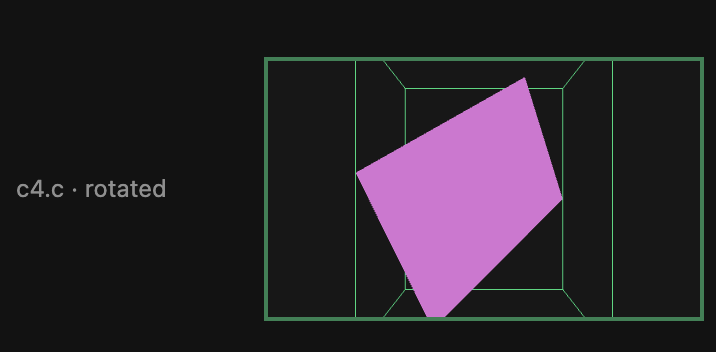
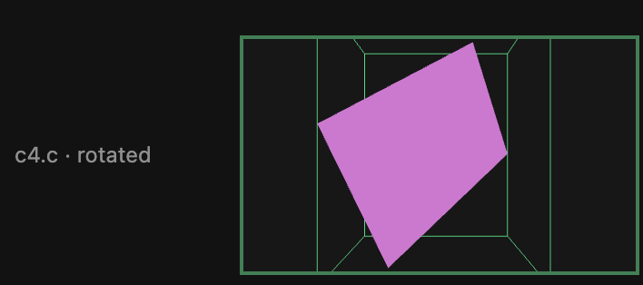
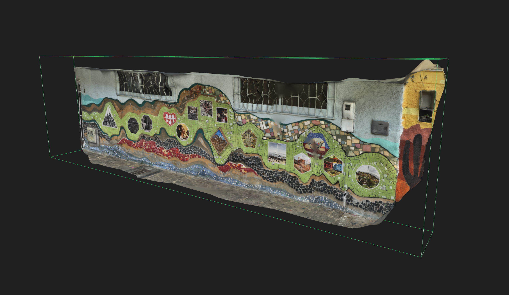
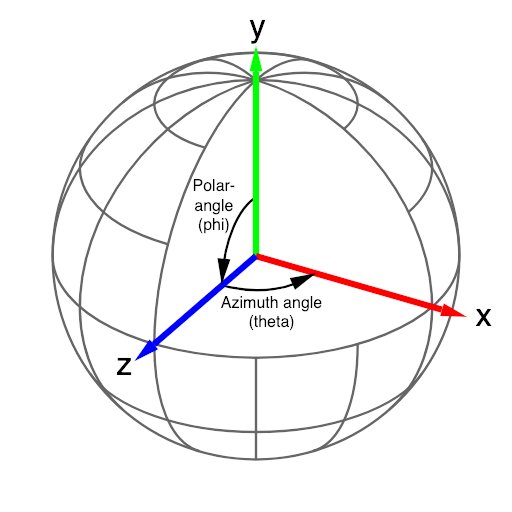
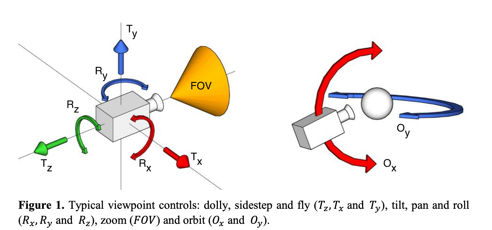
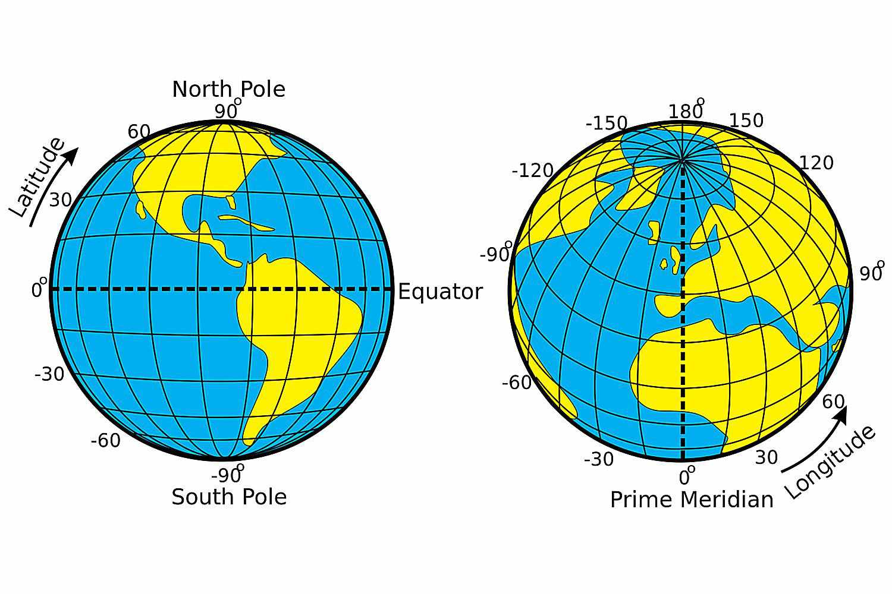
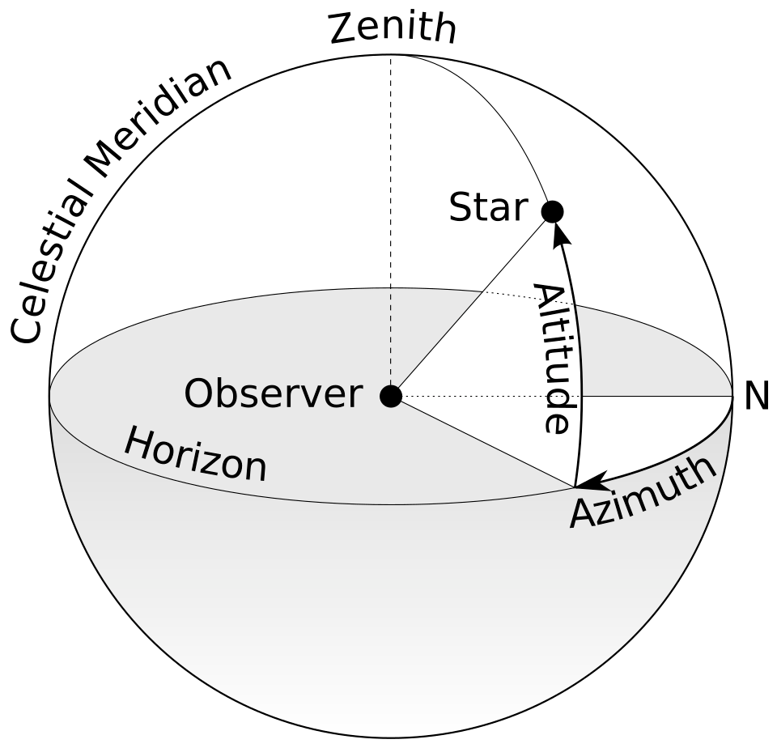
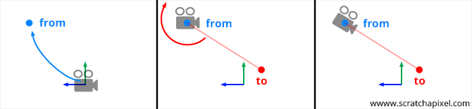

## Framing problem

- optimizing 3 things
	- From the csv - files before software philosphy: what is a good author-facing parameter vocabulary for 3D camera poses?
		- For 3D it may very well be that users just need to use the UI is just too hard to specify this otherwise
	- for the dev: what is a standard way these things are defined and can be portable
		- Some libraries seem to be reaching a standard that defines a "high-level" tag..not sure i want to stick with that
	- for the standard: what do tech and digital humnanities standard specify
		- IIIF is still on proposal
		- if I care about this I should store much more data, i.e fov
- files before software philosophy
	- trying to define a minimal computing parametrization of a 3D model staging. the idea is that you load a 3d model and you define a set of "views" that run over slides. This is an addon to a system that already has a definition for views for 2d images defined like this: 
- following telar I did an initial draft, based on telar, where I normalized units based on a bounding box
	- orbit_horizontal	- horizontal rotation 0-1 (0.5 = front. 1 = right. 0 = left)	
	- orbit_vertical	- vertical rotation 0-1 (0.5 = front. 1 = look down. 0 = look up)	
	- orbit_zoom	- (1.0 = model fills viewport. 2.0 = twice as close)
	- orbit_disp_x - (0.5 = center)
	- orbit_disp_y - (0.5 = center)	
	- orbit_disp_z - (0.5 = center)
-  the zoom as fitting the initial viewport fully seems hard to conciliate technically with libraries like model-viewer that fit a bounding sphere so that the object can be freely rotated on the initial view, so there is a tradeoff to development 
-  i want to balance 
	1. the intuitiveness of the csv, the idea is that someone can manually copy-paste and edit this value, but there is an ui where they can manipulate the objects to get these measures, so this may not be absolutely critical to be intuitive
	2. standard and portability of what the users define, if they want to move the model and the scenes they define, can they? 
	3. implementation ease
	4. consideration of digital humanities standards, but this may be something to ignore.

## 3D snapshot definition
#### V2

| Parameter        | Values                                                                                 |
| :--------------- | :------------------------------------------------------------------------------------- |
| orbit_horizontal | horizontal rotation degrees (0 = front. 90 = look from right. -90 = looking from left) |
| orbit_verticcal  | vertical rotation degrees (0 = front. 90 = look from top. -90 = look from bottom)      |
| orbit\_zoom      | (1.0 = model fills bounding sphere. 2.0 = twice as close)                              |
| target\_x        | (0 = center)                                                                           |
| target\_y        | (0 = center)                                                                           |
| target\_z        | (0 = center)                                                                           |
- rationale
	-  Algorithmically, I cannot achieve a representation of an object that maps directly to telar's image space without sacrificing something. If I want to define the space in the bounding box I either have to use an orthographic camera, or have some padding with either the bounding box or the bounding sphere
	- There is also the question of wether this "readibility" of the coordinates really matter for 3D or if users still need the UI and therefore what I should focus on is more the "interoperability"
		- That interoperability is also an open question. 
			- One standard could be the rotation model around an arbitrary center that the native `<model>` object may support and also `<model-viewer>`
			- On the other hand there is IIIF that basically can define an arbitraty scene also a gltf
	- Conclusion 
		- I am inclined to 
			- use orbit camera model
			- use horizontal and vertical rotation
				- use degrees -90 0 90
				- for the vertical use elevation instead of tilt
			- use metrics units for the model pivot defined from the center of the model
			- use the bounding sphere to define zoom 1
			- use three-js? 
				- I think using model-viewer will be too restrictive in case I want to do other stuff in the future 
			- use model viwewer
				- I think it works well with the parameters and I just have to convert the values for the scene 
#### V1

- Trying to copy the approach of telar of a completely zoomed image as a cannonical view

| Parameter        | Values                                                          |
| :--------------- | :-------------------------------------------------------------- |
| orbit_horizontal | horizontal rotation 0-1 (0.5 = front. 1 = right. 0 = left)      |
| orbit_verticcal  | vertical rotation 0-1 (0.5 = front. 1 = look down. 0 = look up) |
| orbit\_zoom      | (1.0 = model fills viewport. 2.0 = twice as close)              |
| target\_x        | (0.5 = center)                                                  |
| target\_y        | (0.5 = center)                                                  |
| target\_z        | (0.5 = center)                                                  |

#### General notes
- The zoom requires a concept of "filling the screen" which is not trivial to translate from 2D to 3D
	- libraries like threejs, and potentially the model html element define the default viewport as the bounding sphere so the object can be easily rotated by the user with an orbit camera. But this is not easy to explain
	- Looking at this in [#Defining a normalized model space based on zoom](#defining-a-normalized-model-space-based-on-zoom)
- The orbit requires different approach than the tilt used in 3d tag libraries to make more sense IMO
	- [#Orbit view Research](#orbit-view-research)
	- [#Orbit view libraries](#orbit-view-libraries)
- There are two options to define the camera that may impact interoperability
	- [#Non-Orbit approaches](#non-orbit-approaches)
	- as a position of the camera, orientation of the camera, FOV (this aligns with IIIF standard v4)
	- as polar coordinates

## Defining a normalized model space based on zoom 
-  If I want to define a normalized pivot then I have to have some "cannonical image space" for the model but it changes depending on the technique. 
- ### Viewports experiment results
1) Box fit I can fit to 
	1) The nearest plane -- like the sphere produces padding
	2) The middle plane -- produces clipping
2) Sphere produces padding
3) I tried to use a library for treejs camera positioning [yomotsu/camera-controls](github.com/yomotsu/camera-controls)
	1) it looks like is the same thing as the box fitting 
	2) But that example just seems to rotate the camera itself, which is not what I want since I want to keep the cannonical view of the model uploaded by the user
4) A fit to bounds can be achieved with an orthographic camera, but that may look like a weird distortion of 3D objects (See [#Orthographic VS perspective](#orthographic-vs-perspective))
5)  it possible to achieve this with a projection camera? what is the tradeoff
	-  When I move the perspective camera around I can center it so that the object is still occupying the full view, but then, how is that useful to what I am trying to achieve with telar? because then I am changing my pivot to make the object fir the view then I am sacrificing the idea of the center of the bounding box 
	  -  centered but clipped: 
    -  translated but full viewport: 

- I can define a perfectly mapped view with an orthographic camera. but its a bit strange and I lose the perspective
	- ### Orthographic VS perspective
	  - perspective 
	  - orthographic 
## Orbit view libraries
### Using`<model-viwewer>` 
- Potential model
	- target: 
		- option 1. keep the default. not normalize on the sphere, user has to know the dimensions of the model 
		- option 2. normalize to the sphere but the bounds are defined by the sphere, so it does not relate to the visible geometry but to the diagonal of the bounding box
	- orbit_vertical
		- option 1.a keep the default aligned with y axis so looking from top is 0, front is 90 and bottom is 180
		- option 2.a use elevation (latitude) so looking from top is 90, front is 0 and bottom is -90
		- option 2.b use elevation (latitude), normalized so looking from top is 1, front is 0 and bottom is -1
- Model viewer docs
	- camera-orbit
		- You can control 
			- the azimuthal, theta, 
			- and polar, phi, angles **(phi is measured down from the top),** 
			- and the radius from the center of the model. 
		- Accepts values of the form "$theta $phi $radius", like "10deg 75deg 1.5m".
		- Also supports units in radians ("rad") for angles and centimeters ("cm") or millimeters ("mm") for camera distance. 
		- **Camera distance can also be set as a percentage ('%'), where 100% gives the model tight framing within any window based on all possible theta and phi values.** 
		- Any time this value changes from its initially configured value, the camera will interpolate from its current position to the new value. Any value set to 'auto' will revert to the default. For camera-orbit, camera-target and field-of-view, parts of the property value can be configured with CSS-like functions. The CSS calc() function is supported for these values, as well as a specialized form of the env() function. You can use env(window-scroll-y) anywhere in the expression to get a number from 0-1 that corresponds to the current top-level scroll position of the current frame. For example, 
		- **a value like "calc(30deg - env(window-scroll-y) \* 60deg) 75deg 1.5m" cause the camera to orbit horizontally around the model as the user scrolls down the page.**
	- camera-target
		- Set the starting and/or subsequent point the camera orbits around. 
		- Accepts values of the form "$X $Y $Z", like "0m 1.5m -0.5m". Also supports units in centimeters ("cm") or millimeters ("mm"). 
		- A special value "auto" can be used, which sets the target to the center of the model's bounding box in that dimension. 
		- Any time this value changes from its initially configured value, the camera will interpolate from its current position to the new value.
### Threejs Spherical

- This class can be used to represent points in 3D space as Spherical coordinates.
	- radius
		- The radius, or the Euclidean distance (straight-line distance) from the point to the origin.
		- Default is 1.
	- phi
		- The polar angle in radians from the y (up) axis.
		- Default is 0.
	- theta
		- The equator/azimuthal angle in radians around the y (up) axis.
		- Default is 0.

##  Orbit view Research

### Latitude - longitude

- This is what makes more sense to me 
	- 3d orbit controls define phi as colatitude
	- 
### Polar coordiantes wikipeda
#### Terminology

The physics convention is followed in this article; (See both graphics re "physics convention" and re "mathematics convention".)

- The radial distance from the fixed point of origin is also called the *radius*, or *radial line*, or *radial coordinate*. 
- The polar angle may be called *[inclination angle](/wiki/Inclination_angle "Inclination angle")*, *[zenith angle](/wiki/Zenith_angle "Zenith angle")*, *[normal angle](/wiki/Normal_vector "Normal vector")*, or the *[colatitude](/wiki/Colatitude "Colatitude")*. 
	- The user may choose to replace the inclination angle by its [complement](/wiki/Angular_complement "Angular complement"), the *[elevation angle](/wiki/Elevation_angle "Elevation angle")* (or *[altitude angle](/wiki/Altitude_angle "Altitude angle")*), measured upward between the reference plane and the radial line—i.e., from the reference plane upward (towards to the positive z-axis) to the radial line. 
	- The *depression angle* is the negative of the elevation angle. *(See graphic re the "physics convention"—not "mathematics convention".)* |  https://en.wikipedia.org/wiki/Spherical_coordinate_system
 - The **horizontal coordinate system** is a [celestial coordinate system](/wiki/Celestial_coordinate_system "Celestial coordinate system") that uses the observer's local [horizon](/wiki/Horizon "Horizon") as the [fundamental plane](/wiki/Fundamental_plane_\(spherical_coordinates\) "Fundamental plane (spherical coordinates)") to define two angles of a [spherical coordinate system](/wiki/Spherical_coordinate_system "Spherical coordinate system"): **altitude** and *[azimuth](/wiki/Azimuth "Azimuth")*. Therefore, the horizontal coordinate system is sometimes called the **az/el system**,<a href="#cite_note-Keck-Az-El-1">[1]</a> the **alt/az system**, or the **alt-azimuth system**, among others. In an [altazimuth mount](/wiki/Altazimuth_mount "Altazimuth mount") of a [telescope](/wiki/Telescope "Telescope"), the instrument's two axes follow altitude and azimuth.<a href="#cite_note-Britannica-horizon-system-2">[2]</a> |  https://en.wikipedia.org/wiki/Horizontal_coordinate_system#elevation
	 - 

## Non-Orbit approaches
### Look-at 
 Positioning the camera in a 3D scene is crucial. In most lessons from Scratchapixel, we typically set the camera's position and orientation (noting that scaling a camera is illogical) using a 4x4 matrix, often referred to as the **camera-to-world** matrix. However, manually configuring a 4x4 matrix can be cumbersome.

Fortunately, there is a method commonly known as the **look-at** method, which simplifies this process. The concept is straightforward. To establish a camera's position and orientation, you need a point in space for the camera's position and another point to define where the camera is aiming. Let's label our first point "from" and our second point "to".

|  https://www.scratchapixel.com/lessons/mathematics-physics-for-computer-graphics/lookat-function/framing-lookat-function.html

### GLTF and IIIE 

- Scene
	- A Scene is a Container that represents a 3D boundless space with infinite height (y axis), width (x axis) and depth (z axis), where 0 on each axis (the origin of the coordinate system) is treated as the center of the scene’s space. The positive y axis points upwards, the positive x axis points to the right, and the positive z axis points forwards (a [right-handed cartesian coordinate system](https://en.wikipedia.org/wiki/Cartesian_coordinate_system#In_three_dimensions)).
	-   
	- Scenes may also have a bounded temporal range via the [`duration`](/api/presentation/4.0/model/#duration) property, in the same way as Canvases and Timelines. Scenes are typically used for rendering 3D models, and can additionally have Cameras and Lights.
	- Scenes use several 3D specific constructions to manage rendering, discussed below.
		-  LightsIt
			- is necessary for there to be a Light within a Scene that illuminates the objects, and if no Light is defined for the Scene, then the client will provide its own default lighting. There are five types of Light: [Ambient Light](/api/presentation/4.0/model/#AmbientLight) (emits evenly throughout the Scene), [Directional Light](/api/presentation/4.0/model/#DirectionalLight) (emits in a given direction), [Image Based Light](/api/presentation/4.0/model/#ImageBasedLight) (emits using an image), [Point Light](/api/presentation/4.0/model/#PointLight) (emits from a point), and [Spot Light](/api/presentation/4.0/model/#SpotLight) (emits from a point, in a given direction).
		-  Cameras
			- A Camera provides a view of a region of the Scene’s space from a particular position within the Scene; the client constructs a viewport into the Scene and uses the view of one or more Cameras to render that region. There are two types of Camera, [Perspective Camera](/api/presentation/4.0/model/#PerspectiveCamera) and [Orthographic Camera](/api/presentation/4.0/model/#OrthographicCamera).
		-  Audio 
			- EmittersAudio is supported within Scenes through Audio Emitter classes, in the same way as light is added to a Scene using Light subclasses. There are three types of Audio Emitter: [Ambient Audio](/api/presentation/4.0/model/#AmbientAudio) (emits evenly throughout the Scene), [Point Audio](/api/presentation/4.0/model/#PointAudio) (emits from a point) and [Spot Audio](/api/presentation/4.0/model/#SpotAudio) (emits from a point in a given direction). They have [`source`](/api/presentation/4.0/model/#source) (an audio Content Resource) and [`volume`](/api/presentation/4.0/model/#volume) properties. |  https://iiif.io/api/presentation/4.0/
